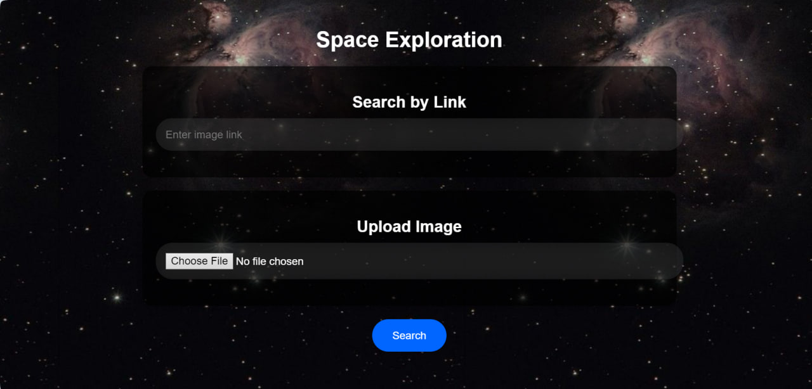
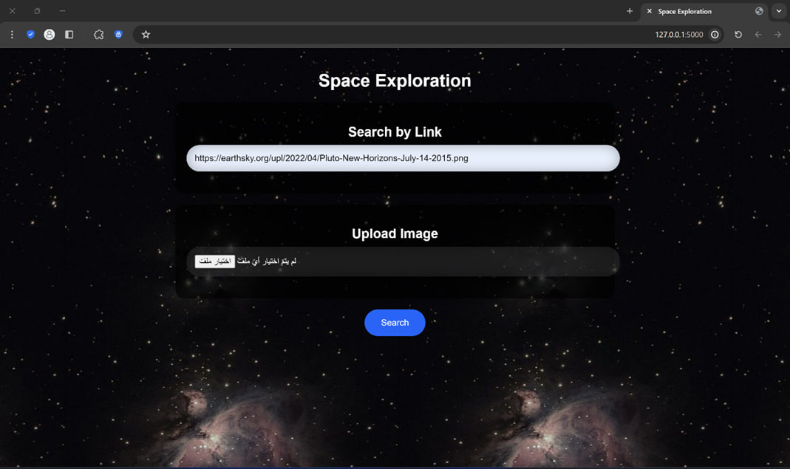
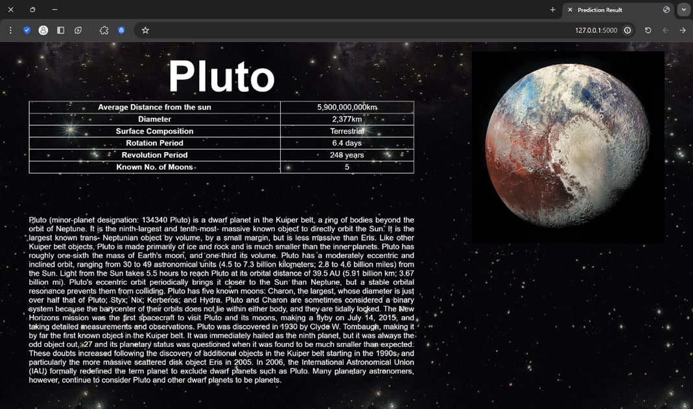
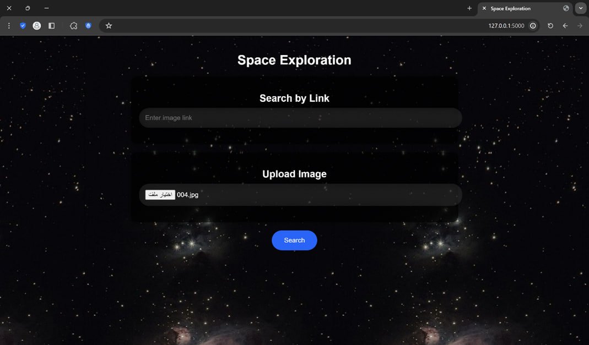
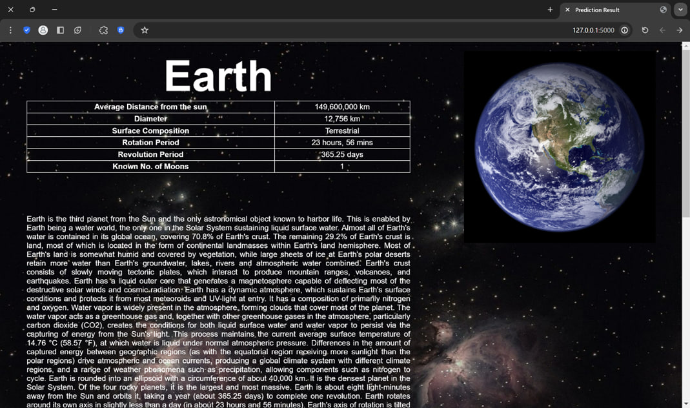
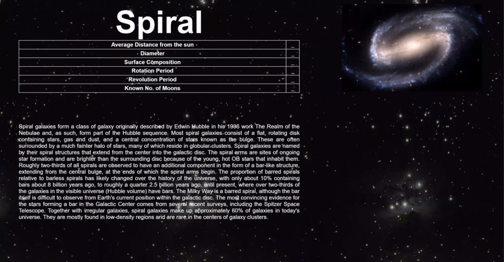

# Space Exploration Using AI

The purpose of this project is to develop an AI model that can accurately classify images of celestial bodies and provide relevant data and descriptions for each image. By leveraging AI techniques, we aim to streamline the analysis of astronomical images and enable researchers and enthusiasts to gain insights into the nature and characteristics of celestial bodies more efficiently. In this project, users will have the ability to search using two methods: by providing a link to an image or by uploading images directly. This dual approach enhances user accessibility and convenience.

## Dataset (images)

### Planets:
- Earth
- Jupiter
- Mars
- Moon
- Neptune
- Pluto
- Saturn
- Uranus
- Venus

### Galaxy:
- Asteroids
- Spiral

## Inference

### Full output

### Search by link

- Output by link

### Search by file

- Output by link

### Galaxy image

[Click here for more information](/absolute/path/to/Space_Exploration/Space_Exploration-Report.pdf)